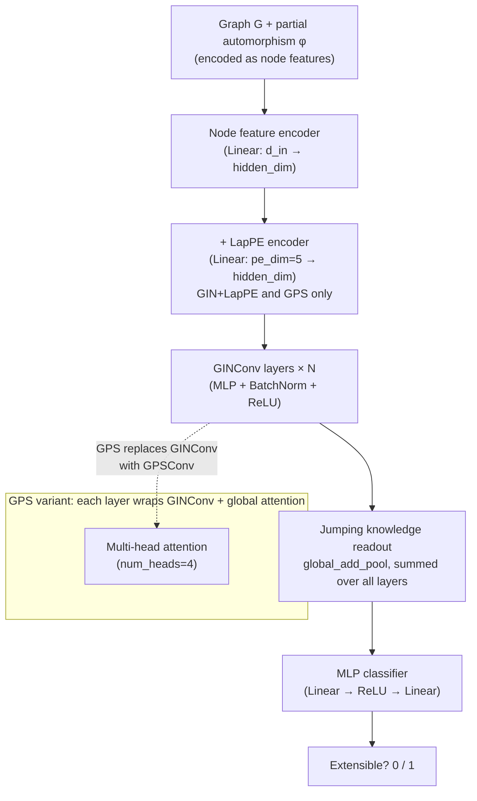

# GNN Extensibility of Partial Graph Automorphisms

Can a graph neural network learn whether a partial automorphism extends to a full one? This repository contains the experiments for my bachelor thesis, which investigates this question using GIN and GPS architectures on a dataset of highly symmetric graphs.

## Problem

A **partial automorphism** of a graph $G$ is an isomorphism between two induced subgraphs. It is **extensible** if it can be completed into a full automorphism $G \to G$.

Given a graph and one of its partial automorphisms (encoded as node features), the task is binary classification: extensible (1) or not (0). This is a non-trivial structural question — checking extensibility requires reasoning about the global symmetry group of the graph.

## Results

Averaged over 5 random seeds on the held-out test split (6,670 examples):

| Model | Features | Val Accuracy | Val F1 |
| --- | --- | --- | --- |
| GIN | 3 (baseline) | 79.8% ± 0.0% | 81.5% ± 0.1% |
| GIN | 3 (baseline, 2× data) | 80.5% ± 0.3% | 82.2% ± 0.3% |
| GIN | 7 (+ structural) | 79.2% ± 0.2% | 81.0% ± 0.6% |
| **GIN + LapPE** | **7 (+ structural)** | **97.8% ± 0.3%** | **97.9% ± 0.3%** |
| GPS | 7 (+ structural) | 97.8% ± 0.3% | 97.9% ± 0.3% |

Adding Laplacian positional encodings (LapPE) produces a jump from ~80% to ~98% accuracy, suggesting that explicit position information — not just local message passing — is key to learning automorphism extensibility.

## Architecture



### Node features

Each node carries features that encode its role in the partial automorphism:

| Index | Feature | Description |
| --- | --- | --- |
| 0 | `node_id` | Normalized node index |
| 1 | `target_id` | If node is in domain of φ: normalized index of its image; else −1 |
| 2 | `source_id` | If node is in codomain of φ: normalized index of its preimage; else −1 |
| 3 | `degree` | Normalized degree *(7-feature variant only)* |
| 4 | `clustering` | Clustering coefficient *(7-feature variant only)* |
| 5 | `triangles` | Normalized triangle count *(7-feature variant only)* |
| 6 | `avg_neighbor_degree` | Normalized average neighbor degree *(7-feature variant only)* |

## Repository Structure

```text
gnn-p-aut-extension/
├── models.py              # GIN, GIN+LapPE, GPS model definitions
├── utils.py               # Training loop, evaluation, metadata utilities
├── evaluate.ipynb         # Compare all models: accuracy, F1, training curves
├── analysis.ipynb         # Confusion matrices, breakdown by graph properties
├── dataset/
│   ├── all_graphs.g6      # 4,985 source graphs (graph6 format)
│   ├── generate.py        # Build train/val/test .pt files from source graphs
│   ├── pe_transform.py    # Add LapPE to existing .pt files (GPS/GIN+LapPE)
│   ├── features.py        # Node feature construction
│   ├── build.py           # Partial automorphism example generation
│   ├── sampling.py        # Partial automorphism sampling
│   ├── graph_utils.py     # Graph I/O and automorphism utilities
│   └── dataset_stats.ipynb
├── kaggle/                # Training notebooks (baseline/, 7_features/, gin_lappe/, gps/)
├── results/               # Optuna trials, best configs, trained weights (.pt)
└── tests/                 # pytest unit tests
```

## Dataset

- **Source graphs:** 4,985 graphs with large automorphism groups (generated with nauty/geng, stored in graph6 format)
- **Split:** 80 / 10 / 10 (train / val / test) by graph
- **Examples:** 82,184 train / 6,732 val / 6,670 test (partial automorphism instances with labels)
- **Label balance:** ~1.15:1 (extensible : non-extensible)

Each example pairs a graph with one sampled partial automorphism. The label is 1 if some full automorphism of $G$ agrees with φ on its domain.

## Installation

Requires Python 3.13 and [uv](https://github.com/astral-sh/uv).

```bash
git clone https://github.com/rivalxy/gnn-p-aut-extension
cd gnn-p-aut-extension
uv sync
```

**Manual install (pip):** Key dependencies are `torch`, `torch-geometric`, `pynauty`, `networkx`, `optuna`, `scikit-learn`, `matplotlib`. See `pyproject.toml` for the full list.

## Reproducing Results

### 1. Generate the dataset

```bash
python dataset/generate.py
```

Reads `dataset/all_graphs.g6`, saves train/val/test `.pt` files and `dataset/splits.json`. Runtime: a few minutes on a laptop.

### 2. Add positional encodings (GIN+LapPE and GPS only)

```bash
python dataset/pe_transform.py
```

Adds 5-dimensional Laplacian eigenvector PE and saves `*_with_pe.pt` files. These are excluded from the repo due to size.

### 3. Train

Training is implemented as Kaggle notebooks in `kaggle/` (one subdirectory per model variant). Each runs Optuna hyperparameter search followed by a 5-seed final evaluation. Pre-trained weights and best hyperparameter configs are saved in `results/`.

### 4. Evaluate

```bash
jupyter notebook evaluate.ipynb
```

Loads checkpoints from `results/`, plots training curves, and reports accuracy and F1. For confusion matrices and per-graph-property breakdowns, use `analysis.ipynb`.

## Testing

```bash
pytest
```

## References

- Xu et al., [*How Powerful are Graph Neural Networks?*](https://arxiv.org/abs/1810.00826) (ICLR 2019) — GIN
- Rampášek et al., [*Recipe for a General, Powerful, Scalable Graph Transformer*](https://arxiv.org/abs/2205.12454) (NeurIPS 2022) — GPS
- McKay & Piperno, [*Practical graph isomorphism, II*](https://doi.org/10.1016/j.jsc.2013.09.003) (2014) — nauty (used for automorphism computation and graph generation)
